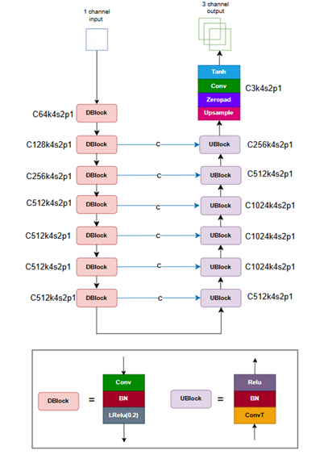
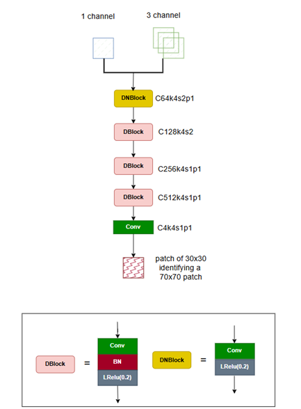
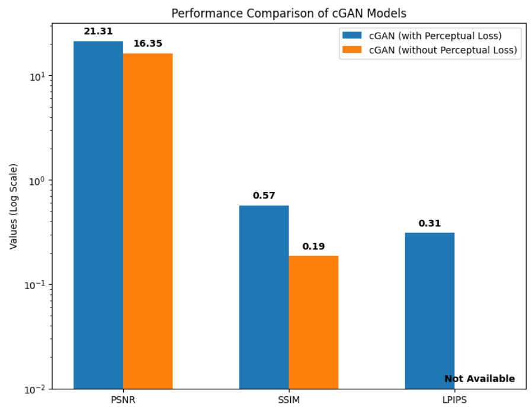
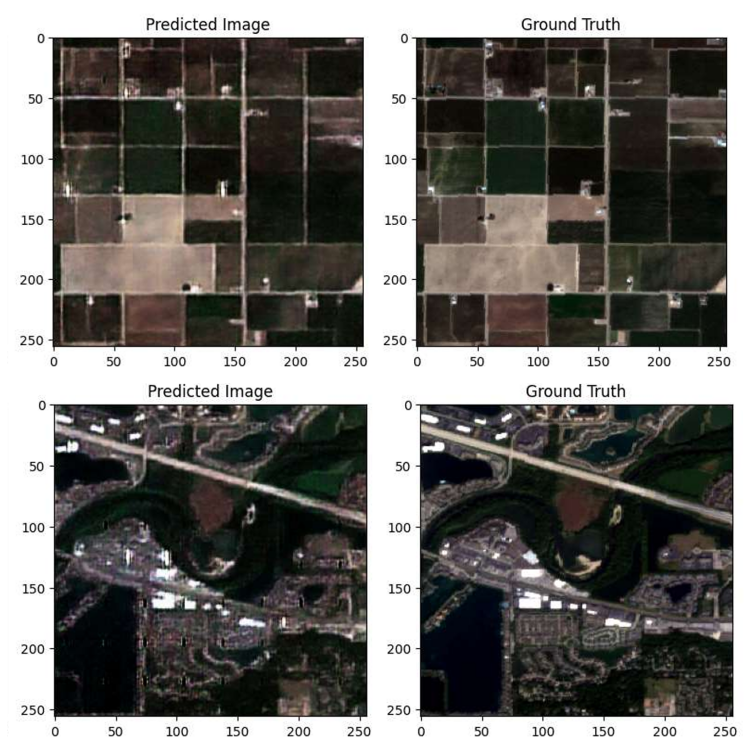

# 🌈 GAN-Based Re-colorization of SAR Grayscale Images

This repository presents a Conditional GAN (cGAN) approach for translating grayscale Synthetic Aperture Radar (SAR) images into realistic RGB images. Leveraging perceptual loss functions and a U-Net-based generator, the model aims to enhance the visual interpretability of SAR data.

## 📁 Repository Structure

- `cGAN_004_train_perceptual_loss.ipynb`: Notebook for training the cGAN model with perceptual loss.
- `cGAN_004_test_cleared.ipynb`: Notebook for testing the trained model on SAR images.
- `cGAN_004_test_metrics.csv`: Contains evaluation metrics like PSNR, SSIM, and LPIPS.
- `cGAN_004_test_results.pdf`: Visual results comparing original and colorized images.
- `GAN_based_re_colorization_of_SAR_grayscale_images.pdf`: Detailed project report.
- `images/`: Directory containing architecture diagrams and sample results.

## 🎯 Project Objectives

- Translate grayscale SAR images into realistic RGB representations.
- Employ cGANs to learn the mapping between SAR and optical domains.
- Evaluate performance using metrics such as PSNR, SSIM, and LPIPS.

## 🧠 Model Architecture

### Generator



The generator utilizes a U-Net architecture with skip connections to preserve spatial information during translation.

### Discriminator



A PatchGAN discriminator is employed to assess the realism of the generated images at the patch level.

## 🗂️ Dataset

- **Source**: Sentinel-1 (SAR) and Sentinel-2 (Optical) satellite images.
- **Preprocessing**:
  - Extracted 128×128 patches.
  - Applied min-max normalization.
  - Performed data augmentation (flipping and rotation).

## 🏋️ Training Details

- **Framework**: TensorFlow / Keras
- **Loss Functions**: Conditional GAN loss combined with L1 and perceptual losses.
- **Optimizer**: Adam
- **Epochs**: 100
- **Batch Size**: 16
- **Evaluation Metrics**: PSNR, SSIM, LPIPS

## 📈 Performance Metrics



The model demonstrates superior performance compared to traditional methods, achieving higher PSNR and SSIM scores, and lower LPIPS values.

## 🖼️ Sample Results

### Input vs. Output



### SAR Image Colorization Examples


## 📄 Reference

For an in-depth understanding, refer to the comprehensive project report:

[GAN_based_re_colorization_of_SAR_grayscale_images.pdf](GAN_based_re_colorization_of_SAR_grayscale_images.pdf)

## 🚀 Getting Started

### Prerequisites

- Python 3.x
- TensorFlow
- Keras
- NumPy
- Matplotlib

Install the required packages:

```bash
pip install -r requirements.txt
