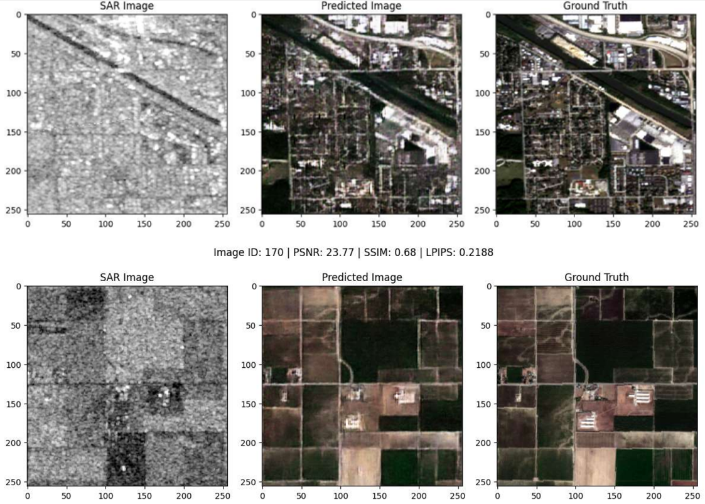

# GAN-Based Re-colorization of SAR Grayscale Images

This repository contains the implementation and results of a project focused on the re-colorization of Synthetic Aperture Radar (SAR) grayscale images using a GAN (Generative Adversarial Network). This project leverages a conditional GAN (cGAN) architecture trained on paired optical and SAR data to reconstruct colorized versions of SAR images.

## 🌟 Project Objectives

- Translate grayscale SAR images into realistic RGB representations.
- Utilize GANs to learn the complex mapping between SAR and optical domains.
- Evaluate and compare results with traditional and other deep learning methods.

## 🧠 Architecture Overview

### Generator Architecture


The generator uses an encoder-decoder network with skip connections (similar to U-Net) to translate SAR inputs into RGB outputs.

### Discriminator Architecture


The discriminator is a CNN that evaluates whether the generated image is realistic, conditioned on the SAR input.

## 🔍 Dataset

- Source: Sentinel-1 (SAR) and Sentinel-2 (Optical) satellite images.
- Preprocessing steps included:
  - Patch extraction (128×128)
  - Min-max normalization
  - Data augmentation (flipping and rotation)

## 🏋️ Training Details

- Framework: TensorFlow / Keras
- Loss Function: Conditional GAN loss + L1 Loss
- Optimizer: Adam
- Epochs: 100
- Batch Size: 16
- Evaluation Metrics: PSNR, SSIM, RMSE, UQI, ERGAS

## 📈 Performance Comparison


The proposed GAN-based method outperformed traditional methods and CNN-based baselines in all major quality metrics.

## 🖼️ Results

### Sample Input vs Output Images


### SAR Image Colorization Examples



## 📚 Reference

This repository is based on the following report:

> *GAN-Based Re-colorization of SAR Grayscale Images*, [Author Name(s)], 2025  
> See full report: [GAN_based_re_colorization_of_SAR_grayscale_images.pdf](./GAN_based_re_colorization_of_SAR_grayscale_images.pdf)

## 🛠️ Setup & Usage

```bash
# Clone the repository
git clone https://github.com/yourusername/sar-colorization-gan.git
cd sar-colorization-gan

# Install dependencies
pip install -r requirements.txt

# Train the model
python train.py

# Test the model
python test.py
